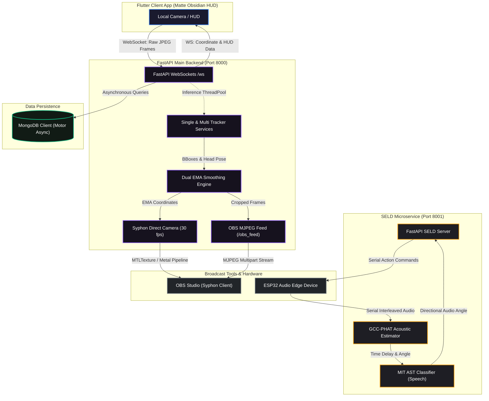

# AFS (Auto Framing Software)

An advanced, AI-driven intelligent camera tracking and acoustic framing ecosystem. AFS seamlessly integrates real-time computer vision, directional audio analysis, and high-performance cross-platform interfaces to function as an autonomous, professional-grade camera operator.

---

## 📐 System Architecture & Data Flow

The following diagram illustrates how the Flutter frontend, FastAPI backend, MongoDB database, and Sound Event Localization and Detection (SELD) microservice interact across network ports and serial connections:



---

## 📂 Codebase & Folder Directory

### 📱 1. `/afs` — Flutter Frontend Application
A sleek client application featuring a **"Matte Obsidian"** dark theme. It captures local high-definition hardware video, handles security workflows, and renders dynamic tracking overlays on its Head-Up Display (HUD).
*   **`lib/main.dart`**: Entrypoint. Leverages multi-threaded isolates (`compute()`) for lightweight, non-blocking JPEG compression and feeds the live frame stream through a WebSocket connection.
*   **`lib/theme.dart`**: Declares aesthetic design tokens, responsive typography (using *Outfit* and *Google Fonts*), and premium smooth shadows.
*   **`lib/screens/`**:
    *   `login_screen.dart` / `signup_screen.dart` / `onboarding_screen.dart`: Modern user access screens using secure secure-storage tokens.
    *   `settings_screen.dart`: Advanced parameter toggles for Visual & Audio tracking systems, OBS connections, and system calibration.
*   **`lib/widgets/`**:
    *   `afs_controls_bar.dart`: Floating bottom controls for starting/stopping OBS virtual cams, Syphon, or recording.
    *   `quick_settings_drawer.dart` / `hud_stat_tile.dart`: Glassmorphic status panel overlays displaying real-time FPS, target lock states, and key stats.

### ⚙️ 2. `/backend` — Python FastAPI Backend
The core computing engine of the project. It orchestrates high-speed ML inferences, database operations, and high-quality recording outputs.
*   **`server.py`**: The server bootstrapper. Opens Port 8000, manages real-time `/ws` connections, supports asynchronous MongoDB updates via `motor`, and implements secure JWT checks.
*   **`services/single_tracker.py`**: A tracking engine that locks on a specific user. Identifies and authenticates the speaker's face, utilizing **DeepFace ArcFace** metrics while computing facial landmark symmetry to determine 3D head rotation (Yaw & Pitch).
*   **`services/multi_tracker.py`**: Combines multiple detected subjects into a unified bounding box and computes the geometric group centroid.
*   **`services/face_recognition.py`**: Quality-filters frames (via Laplacian blur variance and face area checks) to extract pure reference facial embeddings.
*   **`services/audio_processing.py`**: Handles live multi-channel WAV recordings and maps localized spatial coordinates directly to the audio timeline.

### 🧠 3. `/Model` — Machine Learning & Acoustic SELD Prototyping
A research and hardware-integration microservice running alongside the core server.
*   **`fastapi_app.py`**: Runs a dedicated microservice on **Port 8001** to handle background sound event localization.
*   **`seld.py`**: The Sound Event Localization and Detection pipeline:
    1.  **Localization**: Employs **GCC-PHAT** (Generalized Cross-Correlation with Phase Transform) to find Time Delay of Arrival (TDOA) of stereo microphone feeds, mapping a sound's origin angle.
    2.  **Classification**: Integrates the **MIT AST (Audio Spectrogram Transformer)** to classify the sound, prioritizing camera behavior when it detects active "Speech".
    3.  **Hardware Sync**: Communicates via serial connections to receive stereo sound and transmit target angles directly to ESP32 microcontrollers.

---

## ⚡ Mathematical & Core Tracking Concepts

### 1. Strict Target Lock (DeepFace & ArcFace)
To prevent tracking targets from swapping in crowded environments, AFS uses a high-dimensional similarity check:
*   Extracts an embedding vector $\vec{v}_{face} \in \mathbb{R}^{512}$ from the face crop using ArcFace.
*   Computes the Cosine Similarity against a pre-registered master signature $\vec{v}_{ref}$:
$$\text{Similarity} = \frac{\vec{v}_{ref} \cdot \vec{v}_{face}}{\|\vec{v}_{ref}\| \|\vec{v}_{face}\|}$$
*   Only targets exceeding a similarity score of **`0.70`** are designated as `TARGET LOCKED`. Scanning mode continues for unregistered subjects.

### 2. Facial Keypoint Head Pose (Yaw / Pitch)
To track target attention, `single_tracker.py` extracts facial keypoints (eyes, nose, mouth corners) to estimate orientation:
*   **Yaw**: Determined by relative nose-to-eye horizontal distance symmetry:
$$\text{Yaw} = \frac{|x_{nose} - x_{left\_eye}| - |x_{nose} - x_{right\_eye}|}{|x_{nose} - x_{left\_eye}| + |x_{nose} - x_{right\_eye}| + \epsilon}$$
*   **Pitch**: Determined by horizontal nose-to-eye versus nose-to-mouth vertical distance ratios:
$$\text{Pitch} = \frac{y_{nose} - y_{mid\_eyes} - (y_{mid\_mouth} - y_{nose})}{y_{nose} - y_{mid\_eyes} + y_{mid\_mouth} - y_{nose} + \epsilon}$$

### 3. Dual-Layer Exponential Moving Average (EMA)
Camera panning and zoom transformations are calculated dynamically to avoid jagged movements:
$$\text{Pos}_{\text{smooth}} = \alpha \cdot \text{Pos}_{\text{target}} + (1 - \alpha) \cdot \text{Pos}_{\text{current}}$$
*   **Layer 1 (YOLO EMA, $\alpha = 0.90$)**: Updates at the WebSocket inference rate.
*   **Layer 2 (Syphon EMA, $\alpha = 0.08$)**: Runs at a steady **30 FPS**, interpolating the video crop viewport to match the response profile of native Flutter animations.

---

## 📊 Database Schemas & Collections

AFS interacts with a **MongoDB** cluster via FastAPI. The collections include:

| Collection Name | Key Fields | Purpose |
| :--- | :--- | :--- |
| **`users`** | `_id`, `full_name`, `email`, `password_hash`, `embeddings` (Pickle) | Manages authentication, profile data, and pre-computed master face signatures. |
| **`audio_recordings`** | `_id`, `filename`, `content` (Binary WAV), `content_type`, `timestamp` | Stores finalized audio session recording files in the database. |
| **`audio_settings`** | `_id`, `key`, `value`, `updated_at` | Global sound configuration variables (e.g., gain levels, noise gates). |
| **`audio_angles`** | `_id`, `key` ("latest_angle"), `value` (Float), `updated_at` | Persists desired spatial angles as a fallback if visual tracking goes offline. |

---

## 🔌 API Endpoints Specifications

### 🔑 Authentication Routes (Main Backend - Port 8000)
*   **`POST /auth/register`**: Creates a user profile and registers standard user attributes.
*   **`POST /auth/login`**: Verifies user credentials and returns a secure JWT.
*   **`GET /auth/verify`**: Validates JWT authentication headers.

### 🖼️ Face Enrollment & Recognition
*   **`POST /api/enroll_face`**: Processes an uploaded video containing a 360-degree face scan, caching high-quality embeddings.
*   **`POST /api/face/upload-video`**: Main CLI utility endpoint to extract reference vectors from reference scanning files (`my_scan.mp4`).
*   **`POST /api/face/upload-image`**: Extracts single reference signatures from uploaded pictures.
*   **`GET /api/face/cache-status`**: Returns the health state of pre-computed embedding caches.

### 🎙️ Audio Recording & SELD Control
*   **`POST /api/audio/start-stream`**: Spawns and configures a physical audio recording handle.
*   **`POST /api/audio/stop-stream/{session_id}`**: Closes active recording file handles.
*   **`GET /api/audio/recordings`**: Fetches the list of stored wav recordings.
*   **`GET /api/audio/angles`**: Retrieves time-stamped spatial acoustic logs.
*   **`POST /api/audio/set-angle`**: Sets a custom spatial target angle to database collections.
*   **`GET /api/audio/get-angle`**: Fetches the active visual angle; falls back to SELD acoustic angle values if visual indicators are missing.

### 🔌 Live WebSocket Connections
*   **`WS /ws`**: Main bi-directional media socket:
    *   *Frontend-to-Backend*: Streams raw video byte frames, zoom factors, and state commands (`start_recording`, `start_syphon`, `start_obs`, etc.).
    *   *Backend-to-Frontend*: Streams real-time YOLO tracking bounding box dimensions, face names, pose metrics, and HUD stats.
*   **`WS /ws/audio/{session_id}`**: High-speed real-time audio sample socket.

### 📡 OBS & Video Output Services
*   **`GET /obs_feed`**: Serves a continuous multipart MJPEG video stream compatible with any OBS Media Source input.

---

## 🛠️ Complete Setup & Execution

### Prerequisites
*   **Conda Environment Manager** (Anaconda / Miniconda)
*   **Flutter SDK** (^3.9.2)
*   **MongoDB Cluster** (Local server or MongoDB Atlas URL)
*   **Metal-supported macOS system** (for Syphon Virtual Camera pipeline)

### Unified Startup (Recommended)
The project includes a `run.sh` script to launch all subservices in a single shell session:
```bash
chmod +x run.sh
./run.sh
```
*Pressing `Ctrl+C` will trigger a clean shutdown script, closing background ports and stopping camera streams gracefully.*

---

### Manual Step-by-Step Setup

#### 1. Setup the Python Backend
1. Create and activate a Conda environment containing Python 3.10+:
   ```bash
   conda create -n afs_env python=3.11 -y
   conda activate afs_env
   ```
2. Navigate to the backend directory and install system dependencies:
   ```bash
   cd backend
   pip install -r requirements.txt
   ```
3. To use the premium **Syphon zero-latency capture pipeline** (macOS only), install the Syphon bindings:
   ```bash
   pip install syphon-python
   ```
4. Configure your `.env` variables inside `/backend/.env`:
   ```env
   JWT_SECRET_KEY=your-secure-hex-secret-key
   MONGODB_URI=mongodb+srv://<user>:<password>@cluster.mongodb.net/
   MONGODB_DB=afs
   ```
5. Launch the FastAPI server:
   ```bash
   python server.py
   ```

#### 2. Run the SELD Audio Microservice
1. Open a new terminal tab and activate the environment:
   ```bash
   conda activate afs_env
   cd Model
   ```
2. Run the audio tracking application:
   ```bash
   python fastapi_app.py
   ```
   *Note: Ensure your ESP32 microdevice is connected via USB. The script will automatically locate the serial device at `/dev/cu.usbmodem*`.*

#### 3. Launch the Flutter Client HUD
1. Ensure your Flutter environment is configured correctly:
   ```bash
   cd afs
   flutter doctor
   ```
2. Fetch Dart dependencies:
   ```bash
   flutter pub get
   ```
3. Boot the application on macOS (supporting direct hardware access and WebSocket streaming):
   ```bash
   flutter run -d macos
   ```

---

## 💡 Developer Guidelines for AI Assistants & Contributors

*   **Premium HUD Theme Colors**: Maintain the Matte Obsidian dark theme palette. Color variables are defined inside [theme.dart](file:///Users/adisankarlalan/Documents/GitHub/afs-fl/afs/lib/theme.dart).
*   **Isolate Architecture**: Always isolate computationally expensive front-end processes (like video frame parsing and WebSocket packaging) inside separate threads using `compute()` to prevent visual frame rate drops.
*   **Async DB Updates**: Use non-blocking, asynchronous drivers (`motor` / `AsyncMongoClient`) for all backend database operations inside [server.py](file:///Users/adisankarlalan/Documents/GitHub/afs-fl/backend/server.py).
*   **Syphon Thread Coupling**: The Syphon Metal streaming pipeline must remain independent of WebSocket frame delivery speeds. The Syphon capture process runs inside a standalone thread, using the visual tracking system’s EMA values solely to set crop coordinates.
